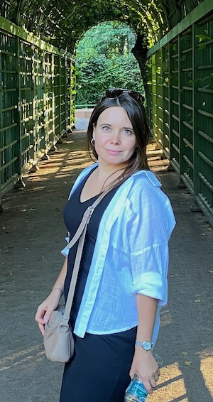

# Немного обо мне

Меня зовут ***Хлыстова Светлана***, я родилась в холодном сибирском городе [Красноярске](https://ru.wikipedia.org/wiki/%D0%9A%D1%80%D0%B0%D1%81%D0%BD%D0%BE%D1%8F%D1%80%D1%81%D0%BA) в 1989 году. Школа, институт, работа. Все как по заданному расписанию. Только работа удовольствия не доставляла, т.к. по своей юношеской неопытности выбрала то, чем не очень-то и хотела заниматься.

## Путь к новому

Около года назад в моей жизни произошли некоторые изменения, благодря которым, я открыла для себя возможность приобрести новую специальность, которая более мне близка, чем та, которой я занималась свыше 10 лет, и при этом достигла определенного карьерного роста. Поэтому бросив все, по причине тотального выгорания, я решила начать свой новый профессиональный путь не смотря ни на что. И теперь занимаюсь на курсах Нетологии.

## Переквалификация

Не сказать, что учеба дается мне очень легко, т.к. моя прошлая специальность только косвенно затрагивала очень малую долю того, что приходится сйечас изучать. Но многие софт скиллы, приобретенные на моей прошлой работе, помогают мне сейчас в текущем обучении. Надеюсь, что у меня все получится и я найду для себя новое место в профессиональной среде.

## Жизненые уроки

Сделав такой координальный поворот в своей жизни, я поняла, что не нужно бояться перемен. А нужно:

1. Верить в себя.
2. Проявлять упорство в достижении выбранных целей.
3. Не унывать, если что-то не получается.